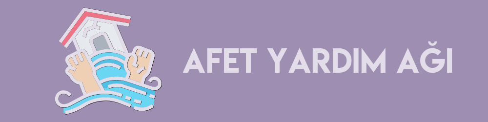
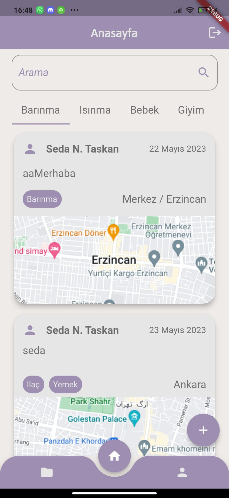
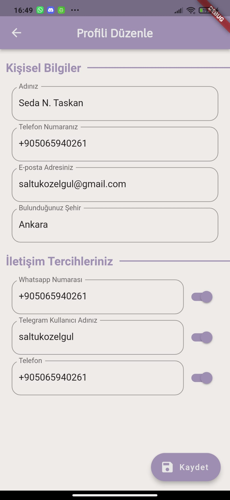
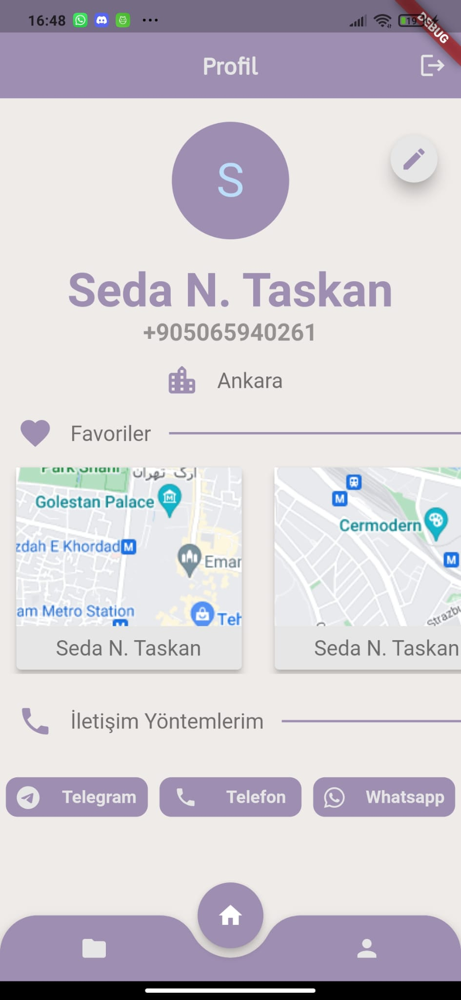

  <h1> AYA </h1>

  

   
  Bu proje, doğal afetlerin ardından ortaya çıkan yardımlaşma ihtiyacını karşılamak için bir mobil uygulama geliştirmektir. Yardımseverlerin ve yardıma ihtiyacı olan kişilerin kolayca kullanabileceği bir platform sağlamayı hedeflemektedir.

## Özellikler 
- Kullanıcılar telefon numaralarıyla giriş yapabilirler.
- Kayıt yoksa, kullanıcılar onay koduyla sisteme kaydolabilirler.
- Kayıtlı kullanıcılar, onay koduyla kimliklerini doğrulayabilirler.
- Kullanıcılar, konum bilgisiyle birlikte ihtiyaçlarını belirterek ilan oluşturabilirler.
- Yardımseverler, girilen ilanları inceleyerek yardım etmek istedikleri ilanları seçebilirler.
- Yardımseverler, girdikleri ilanı favorilerine ekleyebilir; eklediği ilanları porfil sayfasında kolaylıkla görebilir.
- Yardımseverler, ihtiyaç sahipleriyle ihtiyaç sahibinin verdiği iletişim yollarından iletişime geçebilir.

## Ekran Görüntüleri

  
  
  

## Kullanılan Teknolojiler

   
     
  

